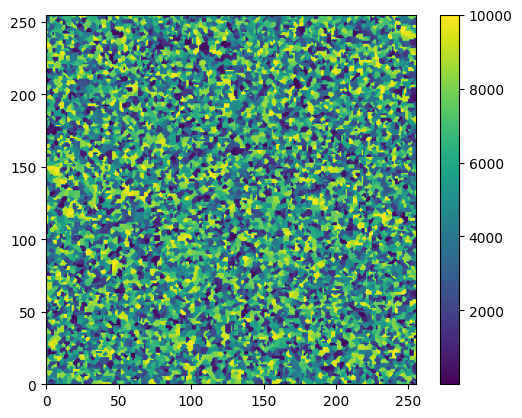

# Facial Recognition and Digital Microstructure Evolution

## Table of Contents
- [Facial Recognition using CUDA](#facial-recognition-using-cuda)
  - [Our Dataset](#our-dataset)
  - [Working of Facial Recognition using CUDA](#working-of-facial-recognition-using-cuda)
  - [Plots and Analysis with and without using CUDA](#plots-and-analysis-with-and-without-using-cuda)
- [Digital Microstructure Evolution with MPI Parallelization](#digital-microstructure-evolution-with-mpi-parallelization)
  - [Working of parallel.py](#working-of-parallelpy)
  - [Working of serial.py](#working-of-serialpy)
  - [Comparison between Serial and Parallel (MPI) Plots](#comparison-between-serial-and-parallel-mpi-plots)
- [Contributors](#contributors)
- [Thank You](#thank-you)

---

# Facial Recognition using CUDA

This section of the repository focuses on facial recognition using CUDA technology and is a collaborative effort by Rithvik, Rohit, and Harshit.

## Our Dataset

The DigiFace-1M dataset is a collection of over one million diverse synthetic face images for face recognition.

DigiFace1M provides a large and varied set of synthetic face images. This dataset is essential for creating a robust model capable of handling diverse facial features, expressions, and lighting conditions.

The dataset contains:

720K images with 10K identities (72 images per identity). For each identity, 4 different sets of accessories are sampled and 18 images are rendered for each set.
500K images with 100K identities (5 images per identity). For each identity, only one set of accessories is sampled.
We are using one part of this dataset with 166K images.

This FaceDataset class is designed for creating a triplet dataset for training a facial recognition model. It inherits from the PyTorch Dataset class and takes a list of identity folders as input, where each folder contains images of a specific individual. During training, it randomly selects an anchor image, a positive image (belonging to the same identity as the anchor but different from it), and a negative image (belonging to a different identity) to form a triplet. The dataset is then used to train a neural network to learn facial embeddings in an unsupervised manner. This approach encourages the model to map faces of the same identity close together in the embedding space while keeping faces of different identities apart, contributing to improved facial recognition performance.

## Working of Facial Recognition using CUDA

This facial recognition project utilizes the DigiFace1M dataset, a collection of over one million diverse synthetic face images designed for face recognition applications. The goal of this project is to train a facial recognition model that can accurately identify and classify faces in real-world scenarios.

## Plots and Analysis with and without using CUDA

[Insert relevant plots and analysis here]

---

# Digital Microstructure Evolution with MPI Parallelization

In this section, the team explores the digital microstructure evolution using MPI (Message Passing Interface) parallelization. Three contributors, Rithvik, Rohit and Harshit have developed `parallel.py` and `serial.py` to simulate and visualize the evolution process.

## Working of parallel.py

`parallel.py` simulates the `evolution of a digital microstructure and calculates the fraction of grain boundary pixels`. The simulation is parallelized using `MPI (Message Passing Interface)` for distributed computing.

The program simulates the evolution of a digital microstructure in a parallelized manner using MPI, calculates grain boundary pixels, and provides timing and output information. The parallelization allows for distributed processing of the microstructure, improving efficiency for large-scale simulations.

Initialization :
   - The program starts by initializing MPI communication, getting the current rank, and the total number of processes.
   - It sets the size of the grid (`sizeGrid`) and the number of nucleation sites (`num_grains`).
   - A digital microstructure grid (`microstructure`) is created with nucleation sites randomly assigned integer values.
   - The initial microstructure is visualized as a heatmap and saved to a file (`parallelMicro.png`).

Nucleation Site Replacement :
   - The program creates a copy of the microstructure (`updated_microstructure`) and iterates over each pixel with a value of 0.
   - For each 0 pixel, it replaces the value with the value of the nearest non-zero pixel in the microstructure.
   - The updated microstructure is visualized as a heatmap and saved to a file (`parallelMicro2.png`).

Grain Boundary Calculation Function :
   - There is a function (`calculate_grain_boundary_pixels`) that calculates the number of grain boundary pixels in a given subgrid assigned to a processor.
   - It considers neighboring rows and columns to determine grain boundary pixels.

Grid Division and Communication :
   - The grid is divided into four subgrids, and each subgrid is sent to a different processor (Rank 1, 2, 3).
   - Each processor also receives the neighboring rows and columns of its subgrid from the master process.

Grain Boundary Calculation :
   - Each processor calculates the number of grain boundary pixels in its assigned subgrid using the `calculate_grain_boundary_pixels` function.
   - The results are then reduced using MPI's `comm.reduce` operation to obtain the total number of grain boundary pixels.

Timing and Output :
   - The program measures the execution time using MPI's wall time.
   - The execution time and the fraction of grain boundary pixels are printed by the master process.

## Working of serial.py

`serial.py` simulates the evolution of a digital microstructure, visualize it, replace certain pixels with their nearest non-zero neighbors, calculate the fraction of grain boundary pixels, and measure the execution time. 

Initialization :
   -  A grid (`arr`) of size `gridSize x gridSize` is initialized with zeros.
   - `numGrains` nucleation sites are randomly assigned whole numbers in the grid.

Visualization (Heatmap) :
   - The initial microstructure is visualized as a heatmap and saved to a file (`serial1.png`).

Nearest Non-Zero Pixel Replacement : 
   - A copy of the grid (`arr1`) is created.
   - For each pixel with a value of 0, it is replaced with the value of its nearest non-zero neighbor.
   - The updated microstructure is visualized as a heatmap and saved to a file (`serial2.png`).

 Grain Boundary Calculation :
   - A function (`calculate_fraction_of_grain_boundary_pixels`) is defined to calculate the fraction of grain boundary pixels in the matrix.
   - It considers the neighbors of each pixel and checks if the sum of neighbors is non-zero.
   - The fraction of grain boundary pixels is calculated as the ratio of grain boundary pixels to the total number of pixels.

Execution Time Measurement :
   - The script measures the execution time of the grain boundary calculation.
   - The start and end times are recorded, and the difference is multiplied by 10^3 to convert seconds to milliseconds.

Output :
   - The execution time and the fraction of grain boundary pixels are printed.

## Comparison between Serial and Parallel (MPI) Plots

The comparison plots showcase the performance differences between the serial and parallel approaches for different numbers of grains in the microstructure.

  

    
<strong> With `Number of Grains` : 500 (Parallel)</strong>

    
    
  

  
  

    
<strong>With `Number of Grains` : 500 (Serial)</strong>

    
    
  

  

    
<strong>Comaprision for Number of Grains: 500</strong>

    
  

  

    
<strong>With `Number of Grains` : 1000 (Parallel)</strong>

    
    
  

  
  

    
<strong>With `Number of Grains` : 1000 (Serial)</strong>

    
    
  

  

    
<strong>Comaprision for Number of Grains: 1000</strong>

    
  

  

    
<strong>With `Number of Grains` : 10000 (Parallel)</strong>

    
    
  

  
  

    
<strong>With `Number of Grains` : 10000 (Serial)</strong>

    
    
  

  
  

    
<strong>Comaprision for Number of Grains: 10000</strong>

    
  

# Contributors

- Rithvik
- Rohit
- Harshit

# Thank You
[(Back to top)](#facial-recognition-and-digital-microstructure-evolution)

「ありがとうございます、先生」
